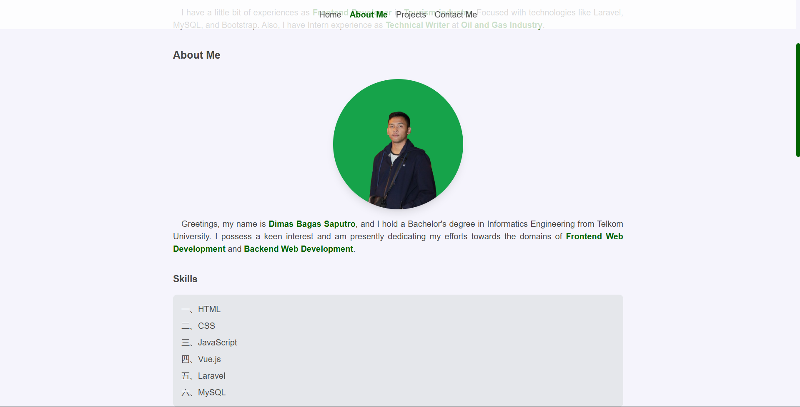
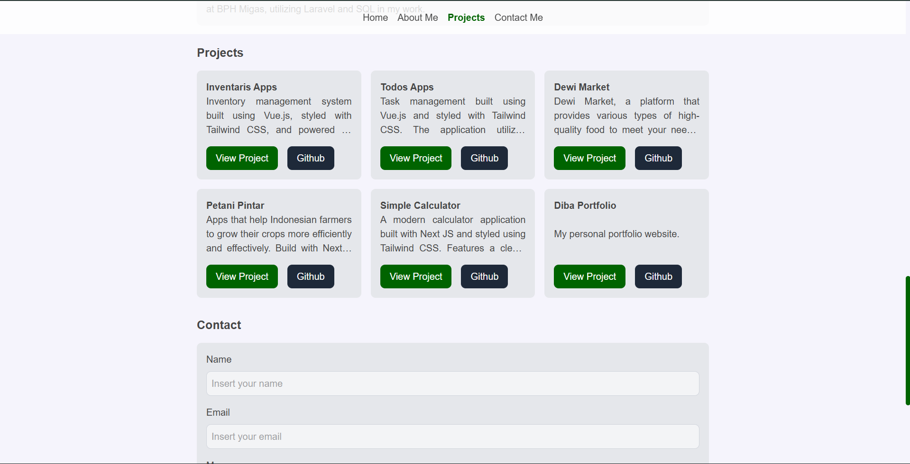
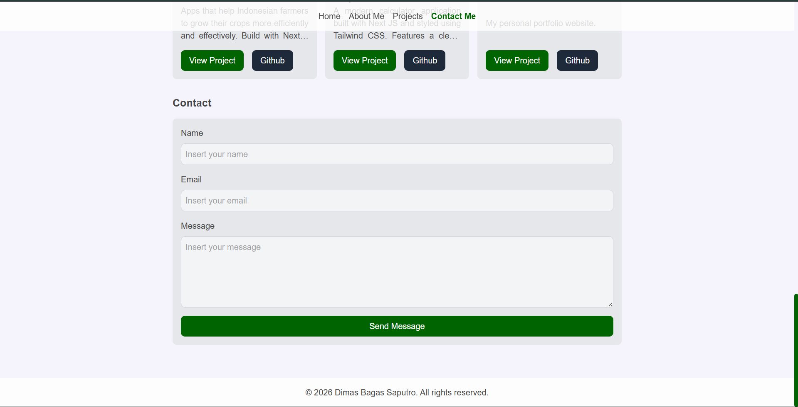

[](https://classroom.github.com/a/2AGu9A8s)

# Overview

Simple resume about me, built with just HTML, CSS, and a little bit of JavaScript. This project is a great way to
practice your web development skills and create a professional-looking resume that you can share with potential
employers.

## ✨ Github Pages

### Preview Web: [Click here!](https://revou-fsse-feb26.github.io/milestone-1-Diba15/)

---

## 🚀 Features

| Feature                 | Description                                                                                                                       |
|-------------------------|-----------------------------------------------------------------------------------------------------------------------------------|
| Responsive Design       | The resume is designed to be responsive, meaning it will look great on any device, whether it's a desktop, tablet, or smartphone. |
| Clean and Modern Layout | The resume features a clean and modern layout that is easy to read                                                                |

---

## 🛠️ Tech Stack

- HTML: Used for structuring the content of the resume.
- CSS: Used for styling the resume and making it visually appealing.
- JavaScript: Used for adding interactivity, such as click navbar.

## 📸 Screenshots

| Image                                                      | Description |
|------------------------------------------------------------|-------------|
|  | Home        |
|  | About       |
|  | Projects    |
|  | Contact     |

## 📂 Project Structure

```bash
module1/
|-- assets/  # Assets Folder
|   |-- pictures/ # Pictures Folder
|   |-- main.css
|   |-- index.js
|-- index.html
|__ README.md
```