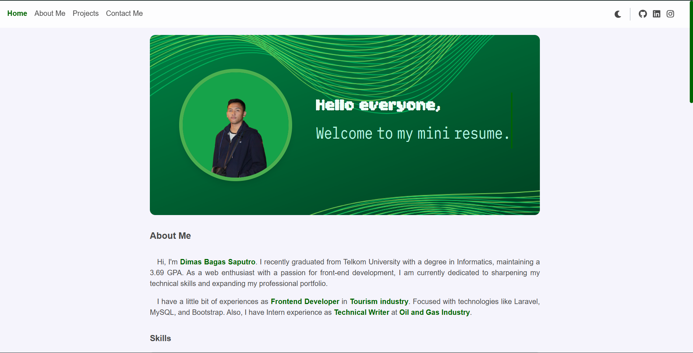
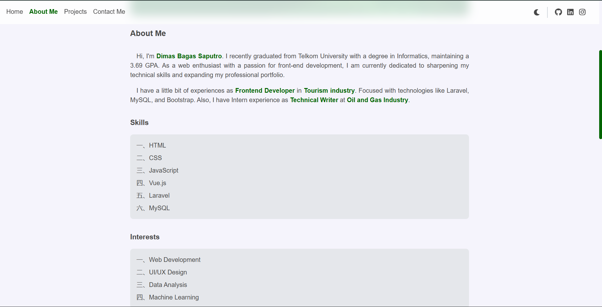
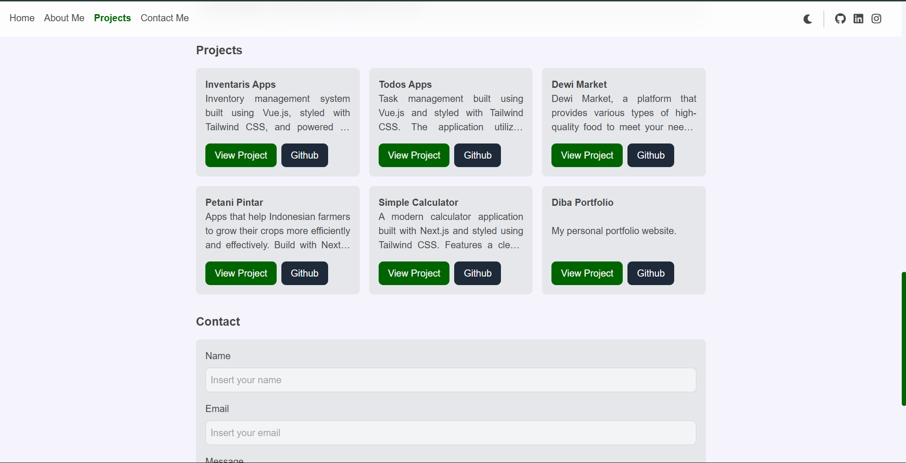
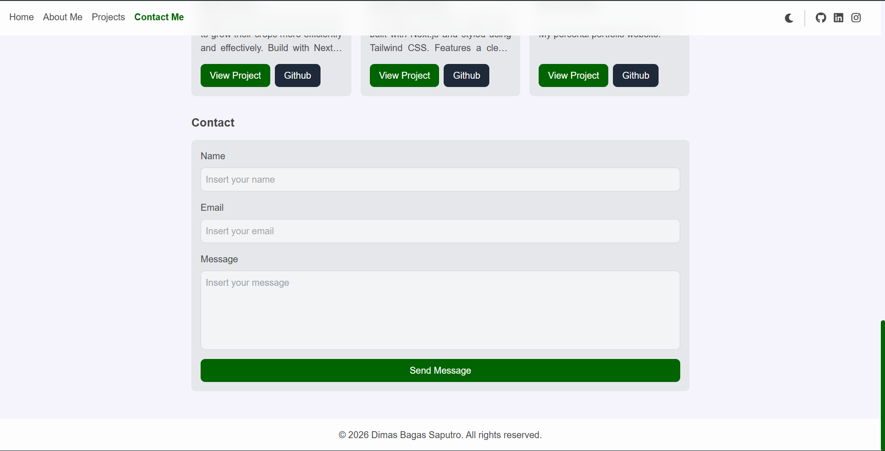

[](https://classroom.github.com/a/2AGu9A8s)

# 👁️ Overview

Simple resume about me, built with just HTML, Tailwind CSS, and a little bit of JavaScript. This website build for assignment milestone 1 of Revou FSSE.

## 📃 Github Pages

### Preview Web: [Click here!](https://revou-fsse-feb26.github.io/milestone-1-Diba15/)

---

## 📋 Features

| Feature                      | Description                                                                                                                              |
|------------------------------|------------------------------------------------------------------------------------------------------------------------------------------|
| Responsive Design            | The resume is designed to be responsive, meaning it will look great on any device, whether it's a desktop, tablet, or smartphone.        |
| Clean and Modern Layout      | The resume features a clean and modern layout that is easy to read                                                                       |
| Interactive Navbar           | The resume includes an interactive navbar that allows users to easily navigate through different sections of the resume.                 |
| Smooth Scrolling             | The resume includes smooth scrolling functionality, providing a seamless user experience when navigating through the different sections. |
| Hover Effects                | The resume includes hover effects on various elements, such as buttons and links, to enhance interactivity and visual appeal.            |
| Contact Form with Validation | The resume includes a contact form that allows users to easily get in touch with the resume owner.                                       |
| Animations                   | The resume includes animations such as typing animation and lampuRusak animation in Hero Section to make the user experience more engaging and visually appealing.                                         |
| Light/Dark Mode              | The resume includes a light and dark mode toggle that allows users to switch between light and dark themes.                           |
| Loading Screen               | The resume includes a loading screen to provide a smooth transition when the page loads.                                                   |
| Scroll-based active navbar    | The resume includes a scroll-based active navbar that highlights the current section being viewed.                                       |

---

## 🛠️ Tech Stack

[](https://skillicons.dev)

- HTML: Used for structuring the content of the resume.
- Tailwind CSS: Used for styling the resume and making it visually appealing.
- JavaScript: Used for adding interactivity, such as click navbar.

## 📸 Screenshots

| Image                                                      | Description |
|------------------------------------------------------------|-------------|
|  | Home        |
|  | About       |
|  | Projects    |
|  | Contact     |

## 📂 Project Structure

```bash
milestone-1-Diba15/
|-- assets/  # Assets Folder
|   |-- pictures/ # Pictures Folder
|   |-- index.css
|   |-- index.js
|-- index.html
|__ README.md
```